# Dragon Quest 1 MMO

<!-- GitHub face for humans — protocol lives in AGENTS.md only -->

<p align="center">
  
</p>

<p align="center">
  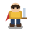
  &nbsp;
  
  &nbsp;
  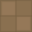
  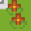
  
  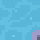
  &nbsp;
  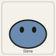
  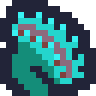
  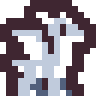
  &nbsp;
  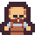
</p>

<p align="center">
  <b>A Dragon Quest&nbsp;I–style multiplayer adventure</b><br/>
  <sub>One shared overworld · classic 1v1 combat · Love2D client · FastAPI server</sub><br/>
  <sub><b>v0.5.142</b> · <b>738</b> tests green · <code>/accept</code> · <code>/decline</code> meetup · near/far · shop · <b>humans ≠ agents</b></sub>
</p>

<p align="center">
  <a href="https://skillicons.dev"></a>
</p>

<p align="center">
  
  
  
  
  
</p>

<p align="center">
  <a href="https://github.com/Im-Nova-Dev/dq1_mmo/stargazers"></a>
  <a href="https://github.com/Im-Nova-Dev/dq1_mmo/network/members"></a>
  <a href="https://github.com/Im-Nova-Dev/dq1_mmo/issues"></a>
  <a href="https://github.com/Im-Nova-Dev/dq1_mmo/commits/main"></a>
  <a href="https://github.com/Im-Nova-Dev/dq1_mmo/actions"></a>
  
  
  
  
  
  
</p>

<p align="center">
  <a href="#-quick-start"><b>Quick start</b></a>
  ·
  <a href="#-whats-new"><b>What's new</b></a>
  ·
  <a href="#-highlights"><b>Highlights</b></a>
  ·
  <a href="#-how-it-fits-together"><b>Architecture</b></a>
  ·
  <a href="#-controls"><b>Controls</b></a>
  ·
  <a href="docs/HUMAN.md"><b>Player guide</b></a>
  ·
  <a href="client/assets/ATTRIBUTION.md"><b>Art</b></a>
  ·
  <a href="#-documentation"><b>Docs map</b></a>
</p>

---

<p align="center">
  Explore <b>town</b>, <b>field</b>, and <b>dungeon</b> with other heroes on one shared grid.<br/>
  Server-side 1v1 · shop · whisper · meetup · <code>/invite</code> meetup · near/far · <code>/poke</code> · <b>soft reconnect</b>.
</p>

<p align="center">
  
  
  
  
  
  
  
  
  
  
  
  
  
  
  
  
  
  
  
</p>

> [!NOTE]
> **Fan project.** Inspired by *Dragon Quest I / Dragon Warrior*. **Not** affiliated with Square Enix.  
> **Two audiences on purpose:** people use this page + [HUMAN](docs/HUMAN.md). Coding agents use **[AGENTS.md](AGENTS.md) only** — never a player guide, and **no protocol dumps here**.

<table>
<tr>
<td width="33%" valign="top" align="center">

### 👤 Players
**[docs/HUMAN.md](docs/HUMAN.md)**  
play · controls · hosting  
<sub>plain language only</sub>

<p>
  
</p>

</td>
<td width="33%" valign="top" align="center">

### 🎨 Artists
**[ATTRIBUTION.md](client/assets/ATTRIBUTION.md)**  
drop-in PNGs anytime  
<sub>CC0 · filenames are the contract</sub>

<p>
  
</p>

</td>
<td width="33%" valign="top" align="center">

### 🤖 Agents / LLMs
**[AGENTS.md](AGENTS.md) only**  
protocol · tests · reliability  
<sub>not a player guide</sub>

<p>
  
</p>

</td>
</tr>
</table>

<p align="center">
  <sub><b>At a glance</b></sub><br/>
  
  
  
  
  
  
  
  
  
  
  
</p>

<p align="center">
  
  
  
  
</p>

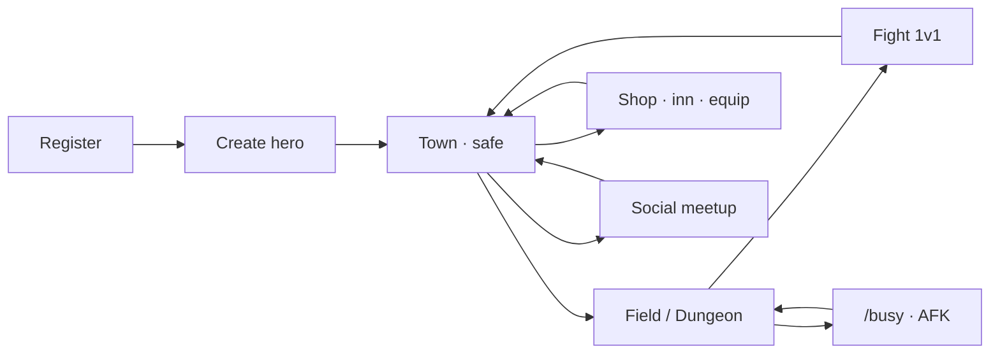

<table>
<tr>
<td align="center" width="16%"><b>🗺️ Play</b><br/><sub>shared grid</sub></td>
<td align="center" width="16%"><b>⚔️ Fight</b><br/><sub>server 1v1</sub></td>
<td align="center" width="16%"><b>🛒 Shop</b><br/><sub>friendly names</sub></td>
<td align="center" width="16%"><b>👋 Social</b><br/><sub>invite · wave</sub></td>
<td align="center" width="16%"><b>📍 Memory</b><br/><sub>@share · @emote</sub></td>
<td align="center" width="16%"><b>☕ AFK</b><br/><sub>/busy · /back</sub></td>
</tr>
</table>

<p align="center">
  <sub>
    <b>Docs stay split:</b>
    <a href="docs/HUMAN.md">players</a> ·
    <a href="client/assets/ATTRIBUTION.md">artists</a> ·
    <a href="AGENTS.md">agents only</a> ·
    <a href="docs/README.md">map</a>
  </sub>
</p>

---

## 📌 Contents

| | Section |
|:--|:--------|
| 🆕 | [What's new](#-whats-new) — **v0.5.142** |
| ✨ | [Highlights](#-highlights) |
| 🧩 | [How it fits together](#-how-it-fits-together) |
| 🚀 | [Quick start](#-quick-start) |
| 🎮 | [Controls](#-controls) |
| 🎨 | [Look & art](#-look--art) |
| 👥 | [Multiplayer tools](#-multiplayer-tools) |
| ⚙️ | [Configuration](#️-configuration) |
| 📁 | [Project layout](#-project-layout) |
| 📚 | [Documentation](#-documentation) — **humans ≠ agents** |
| 🙏 | [Credits](#-credits) |

---

## 🆕 What's new

<p align="center">
  
  
</p>

<p align="center">
  
  
  
</p>

| | **v0.5.142** — **`/accept`** · **`/decline`** meetup reply · **738** tests |
|:--|:--|
| ✅ | **`/accept`** (or **`/coming`**) · they get your zone · near also get map spot |
| 🙅 | **`/decline`** (or **`/later`**) · clear pending · soft reconnect stays honest |
| 🔁 | Failed delivery refunds chat rate, restores AFK, keeps invite for retry |
| 🧪 | **738** automated tests green |

<p align="center">
  
  
  
</p>

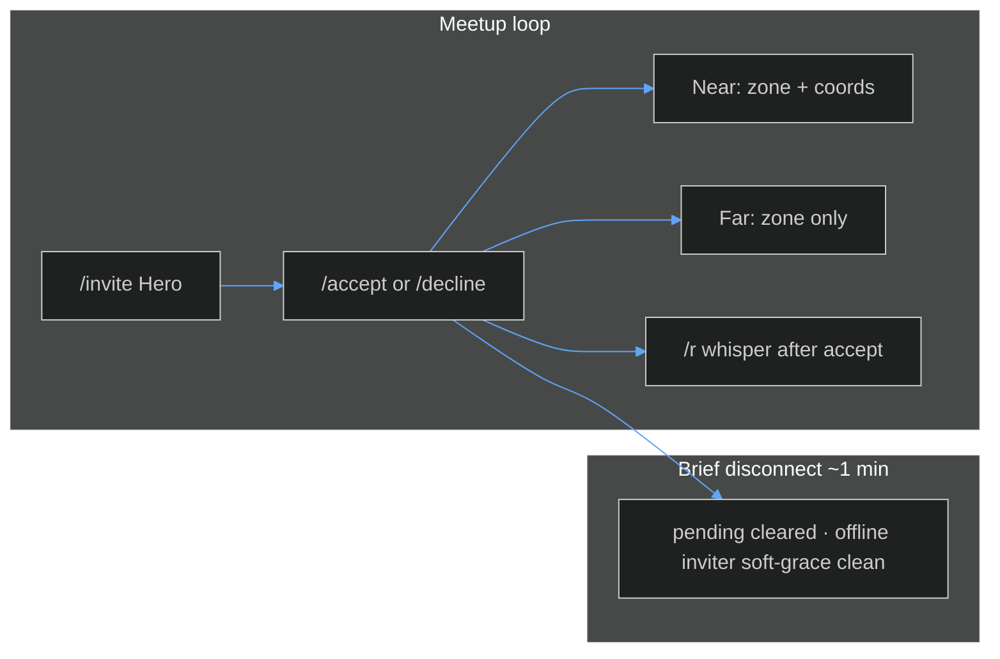

<table>
<tr>
<td width="12%" valign="top" align="center">

### 🤝 Meetup
| | |
|:--|:--|
| **`/invite`** | meetup |
| **`/cancel`** | clear |

<sub>near coords · far zone</sub>

</td>
<td width="12%" valign="top" align="center">

### 📍 Share
| | |
|:--|:--|
| **`/share`** | spot |
| **`@from`** | partner |

<sub>near · far · coords to them</sub>

</td>
<td width="12%" valign="top" align="center">

### 🙏 Thank
| | |
|:--|:--|
| **`/thank`** | thanks |
| **`/ty`** | same |

<sub>near · far · zone</sub>

</td>
<td width="12%" valign="top" align="center">

### 👆 Poke
| | |
|:--|:--|
| **`/poke`** | nudge |
| **`/nudge`** | same |

<sub>near · far · zone</sub>

</td>
<td width="12%" valign="top" align="center">

### 🔍 Find
| | |
|:--|:--|
| **`/find`** | search |
| zone · afk | filters |

<sub>plain · census</sub>

</td>
<td width="12%" valign="top" align="center">

### ☕ AFK
| | |
|:--|:--|
| **`/afk`** | away |
| **`/busy`** | same |
| **`/back`** | return |

<sub>zone · nearby · online</sub>

</td>
<td width="12%" valign="top" align="center">

### 🔇 Mute
| | |
|:--|:--|
| **`/ignore`** | mute |
| **`/ignores`** | list |

<sub>near · far · zone</sub>

</td>
<td width="12%" valign="top" align="center">

### 💰 Peeks
| | |
|:--|:--|
| **`/gold`** | wallet |
| **`/hp`** | vitals |
| **`/buffs`** | effects |

<sub>zone · fight</sub>

</td>
<td width="12%" valign="top" align="center">

### ⏱ Session
| | |
|:--|:--|
| **`/played`** | age |
| **`/version`** | census |

<sub>zone · fight · online</sub>

</td>
<td width="12%" valign="top" align="center">

### 👁 Look
| | |
|:--|:--|
| **L** · **`/look`** | examine |
| near / far | coords / zone |

<sub>plain sentence</sub>

</td>
<td width="12%" valign="top" align="center">

### 💬 Whisper
| | |
|:--|:--|
| **`/r`** | reply last |
| **`/lastwhisper`** | who |

<sub>near/far</sub>

</td>
<td width="12%" valign="top" align="center">

### 📍 Share
| Alias | Means |
|:------|:------|
| **`@share`** | you shared |
| **`@from`** | shared with you |

<sub>**`/lastshare`**</sub>

</td>
<td width="12%" valign="top" align="center">

### 👋 Wave
| Alias | Means |
|:------|:------|
| **`@emote`** | you waved |
| **`@emotedby`** | waved at you |

<sub>**`/lastemote`**</sub>

</td>
<td width="12%" valign="top" align="center">

### 🤝 Meetup
| Command | Means |
|:--------|:------|
| **`/invite`** | meetup |
| **`/pending`** | invites |

<sub>**`/lastinvite`**</sub>

</td>
</tr>
</table>

<p align="center">
  
  
  
</p>

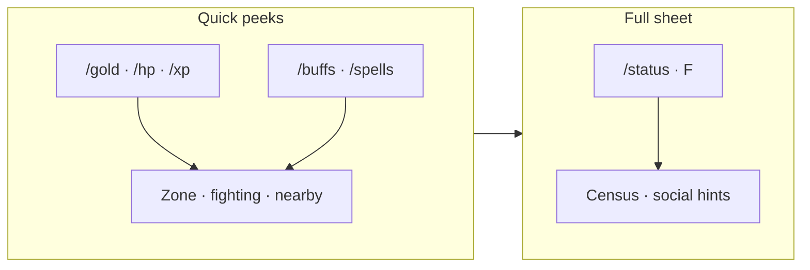

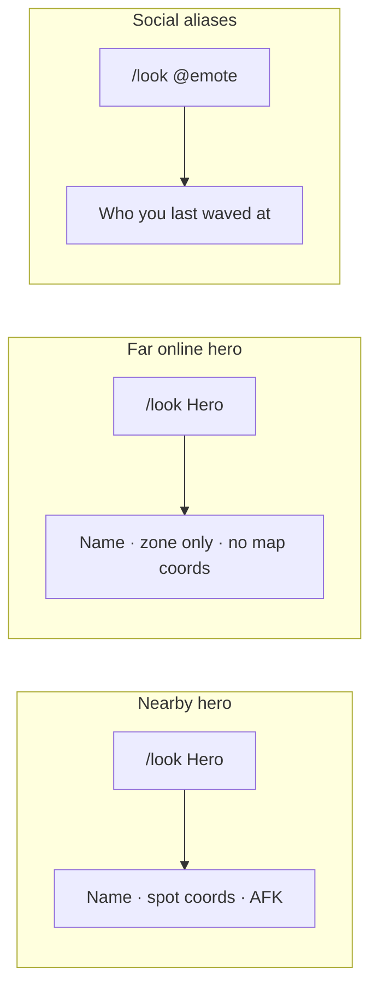

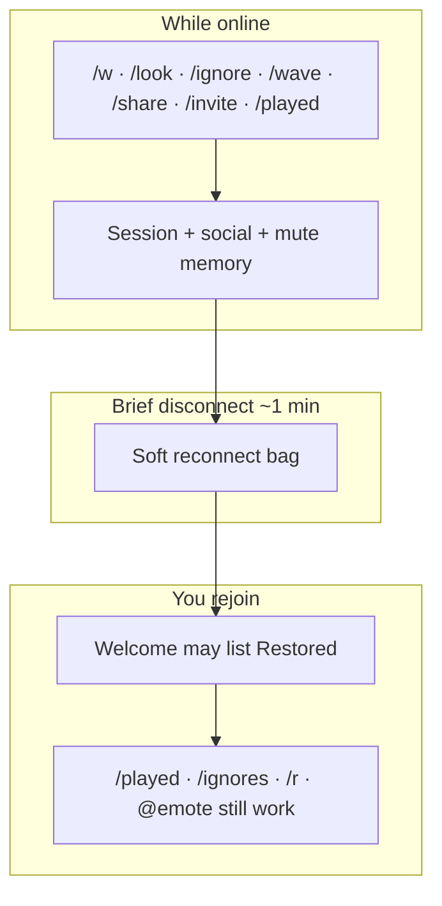

> [!TIP]
> **Meetup loop:** **`/invite Hero`** · **`/askwhere Hero`** · **`/share Hero`** · **`/wave Hero`** · **`/thank @share`** (or **`@from`**) · **`/w @emotedby`** · **`/poke`** · **`/accept`** · **`/r`** · **`/cancel`**.  
> **First hour:** clothes + herbs · **`/buy copper sword`** · **`/wave`** · **`/busy lunch`** · **`/who`** · **`/near`** · **`/stuck`** if lost.

> [!NOTE]
> **Brief disconnect (~1 min):** **mute list** (near/far **and zone** when they are online again), **last whisper**, **share partners**, **emote partners**, **meetup invites**, buffs, and your **`/played` session age** come back when you rejoin.

> [!IMPORTANT]
> **Two audiences, two trees — do not mix.**  
> **People** → this README + [docs/HUMAN.md](docs/HUMAN.md) + [art](client/assets/ATTRIBUTION.md).  
> **Coding agents / LLMs** → **[AGENTS.md](AGENTS.md) only**. Never paste protocol catalogs or test matrices into player pages.

<details>
<summary><b>Earlier releases</b></summary>

<br/>

| Version | Highlights |
|:--------|:-----------|
| **0.5.142** | `/accept` · `/decline` meetup reply near/far + soft-grace clear · **738** tests |
| **0.5.141** | `/invite` meetup near/far + soft-grace memory · **730** tests |
| **0.5.140** | `/cancel` invite soft-grace clear + near/far · **724** tests |
| **0.5.139** | `/share` location + near/far confirm + delivery refund · **719** tests |
| **0.5.138** | `/askwhere` · `/locate` near/far confirm + delivery refund · **714** tests |
| **0.5.137** | `/thank` · `/ty` near/far confirm + delivery refund · **709** tests |
| **0.5.136** | `/poke` · `/nudge` near/far confirm + delivery refund · **704** tests |
| **0.5.135** | `/roll` · `/dice` nearby icebreaker + census · **699** tests |
| **0.5.134** | `/find` plain summary + room census · **694** tests |
| **0.5.133** | `/stuck` · `/home` · `/quit` multiplayer safety census · **688** tests |
| **0.5.132** | `/afk` · `/busy` · `/back` multiplayer census on confirm · **683** tests |
| **0.5.131** | `/keys` · `/help` · `/motd` online census + plain lines · **678** tests |
| **0.5.130** | Mute list zone/AFK · plain mute messages · **673** tests |
| **0.5.129** | `/played` · `/version` · `/time` multiplayer census + plain lines · **667** tests |
| **0.5.128** | Quick peeks (`/gold` · `/hp` · `/buffs` …) zone + fight context · **662** tests |
| **0.5.127** | Status sheet multiplayer census + plain message · **658** tests |
| **0.5.126** | Clearer `/look` · near coords · far zone · **654** tests |
| **0.5.125** | Mute list shows near/far online peers · **648** tests |
| **0.5.124** | Soft reconnect welcome notes session timer restored · **642** tests |
| **0.5.123** | Soft reconnect keeps `/played` session age · **635** tests |
| **0.5.122** | Soft reconnect last whisper near/far peer card · **629** tests |
| **0.5.121** | `/lastinvite` shows to + from (meetup memory) · **623** tests |
| **0.5.120** | Soft reconnect restores share · emote · invite peers · **617** tests |
| **0.5.119** | Two-way waves · `@emote` / `@emotedby` · **610** tests |
| **0.5.118** | Soft reconnect keeps share friends · **601** tests |
| **0.5.117** | `@from` after someone shares with you · **595** tests |
| **0.5.116** | Two-way share memory · **589** tests |
| **0.5.115** | `@share` after you share location · **583** tests |
| **0.5.114** | `/lastshare` · cancel only counts when delivered · **576** tests |
| **0.5.113** | Far `/wave` reliability · `/last` near/far · **570** tests |
| **0.5.112** | Social near/far · reliable whispers · **564** tests |
| **0.5.111** | Accept/decline zone · `r` reply alias · lastemote badges · **556** tests |
| **0.5.110** | Find multi-token filters (no residual prefix) · **547** tests |
| **0.5.109** | `/pending`/`/lastinvite` zone badges · find `you` tag · **540** tests |
| **0.5.108** | Social find filter messaging · `/social` zone/fight badges · **532** tests |
| **0.5.107** | `/social` peers summary · `/find @pending` · **525** tests |
| **0.5.106** | Look/ignore `@pending` · whisper/wave `@pending` · **517** tests |
| **0.5.105** | Whisper/emote `@pending` · bare names not aliases · **509** tests |
| **0.5.104** | `@pending` on poke/share/thank/askwhere · muted cancel text · **503** tests |
| **0.5.103** | Cancel/retarget respect ignore (no mute spam) · **494** tests |
| **0.5.102** | Invite supersede notice · soft-grace purge · guest `/r` after invite · **488** tests |
| **0.5.101** | `/pending` · double-invite clears previous pointers · **479** tests |
| **0.5.100** | Soft-grace invite hygiene — cancel/offline answer clear both peers · **472** tests |
| **0.5.98** | `/askwhere` location request · restore AFK after failed private delivery · **460** tests |
| **0.5.97** | `/poke` · `/nudge` · fighting census on who · multiplayer toasts |
| **0.5.96** | Combat census · find combat:yes · safer cancel after accept |
| **0.5.95** | Cancel invite · share location · meetup loop complete |
| **0.5.94** | Invite one-answer hygiene · safer dice · accept enables `/r` |
| **0.5.93** | Invite accept/decline · fighting peek · lastinvite |
| **0.5.92** | Meetup invites · busy · lastemote · who/near census |
| **0.5.91** | Safer player IDs · clean AFK text · hunt suite |
| **0.5.90** | Emote shortcuts · lastemote · busy · nearby combat |
| **0.5.89** | Starter clothes + 3 herbs · no emotes mid-combat · shop under load |
| **0.5.88** | Directed emotes respect mute / ignore |
| **0.5.87** | `/wave Name` directed emotes · join AFK census |
| **0.5.86** | Health AFK count · change password · `/stuck` clears AFK |
| **0.5.85** | Near / zone AFK census peeks |
| **0.5.84** | Bad `/roll` no longer clears AFK |
| **0.5.83** | Friendly item names · `/buy copper sword` · aliases |
| **0.5.82** | AFK reason · how many AFK online · whisper tip |
| **0.5.81** | `/cast` field magic · `/discard` · cast clears AFK |
| **0.5.80** | Hardening · AFK / shop multiplayer edges |
| **0.5.79** | AFK/back lines · shop clears AFK · AFK duration peeks |
| **0.5.78** | `/buy` · `/sell` · `/use` · `/equip` · `/ping` · `/wave` |
| **0.5.77** | Hardening · stuck / AFK / ignore edges |
| **0.5.76** | Stuck rate fix · nearby return notice · AFK duration |
| **0.5.75** | `/stuck` · `/yell` · `/emote` list |
| **0.5.74** | Hardening · combat gates · AFK whisper · qty/move edges |
| **0.5.73** | `/played` · `/whereis` · reconnect timer · mute list |
| **0.5.72** | `/played` · `/profile` · `/mapinfo` · `/server` · `/s` `/g` |
| **0.5.71** | Hardening · combat move gate · clean first join |
| **0.5.70** | Counts self-card · find idle · soft restore flags |
| **0.5.69** | `/buffs` · `/keys` · `/inspect` · `/blocklist` |
| **0.5.68** | Shout = zone · bare buy/sell need an item |
| **0.5.67** | Join refreshes roster · `/find afk` |
| **0.5.66** | `/hp` · `/xp` · `/unequip` · `/last` · equip toasts |
| **0.5.65** | AFK on rosters · whisper tip · last-whisper after reconnect |
| **0.5.64** | `/gold` · `/spells` · bag aliases · status AFK |
| **0.5.63** | Faster leave roster · cleaner chat / look |
| **0.5.61–62** | Safer buy quantities · multi-buy |
| **0.5.60** | Walk clears AFK · reconnect keeps mute / whisper partner |
| **0.5.58–59** | MOTD · AFK · quit · sell qty fix |
| **0.5.55–57** | `/version` · `/time` · zone chat · safer roll/discard |
| **0.5.40–54** | Soft reconnect · zone social · bag limits · open art |

</details>

<p align="center">
  <a href="docs/HUMAN.md"></a>
  &nbsp;
  <a href="AGENTS.md"></a>
</p>

---

## ✨ Highlights

<table>
<tr>
<td width="50%" valign="top">

### 🗺️ World & combat

| | |
|:--|:--|
| 🗺️ | Shared grid · safe **town** · field · **dungeon** |
| ⚔️ | Server-side DQ1 1v1 · reconnect mid-fight |
| 🏠 | Inn (quote then confirm) · shop · equip · sell · discard |
| ✨ | Heal · Return · **Repel** · **Radiant** · Outside |

</td>
<td width="50%" valign="top">

### 💬 Social & meta

| | |
|:--|:--|
| 💬 | Global · nearby · **zone** · **`/yell`** · whisper · **`/r`** · **`/roll`** |
| 🤝 | **`/invite` · `/accept` · `/decline` · `/cancel` · `/share` · `/lastshare` · `/askwhere` · `/thank` · `/ty` · `/poke`** — social (not a party) |
| 📍 | **`@share`** / **`@from`** · **`@emote`** / **`@emotedby`** — two-way social memory (needs the **@**) |
| 👋 | **`/wave Name`** · **`/wave @last`** · **`/lastemote`** (to + from) · **`/fighting`** · **`/social`** |
| 🔍 | **`/find`** · **`/find combat:yes`** (plain summary) · **`/who`** · **`/counts`** · **`/near`** · **`/zone`** |
| 📊 | **`/hp`** · **`/xp`** · **`/gold`** · **`/buffs`** · **`/played`** · **`/version`** · **`/time`** · **`/bag`** |
| 🏠 | **`/stuck`** · **`/home`** free town return · soft reconnect |
| 🛒 | **`/buy copper sword`** · **`/sell`** · **`/use`** · **`/equip`** · **`/shop`** |
| ✨ | **`/cast`** · **`/repel`** · **`/return`** field magic from chat |
| ☕ | **`/afk lunch`** · **`/busy`** · **`/back`** (zone · nearby · online on confirm) |
| 🔑 | Email accounts can **change password** via API |
| 🦸 | Up to **3 heroes** · start with **clothes** + **3 herbs** |
| 🎨 | Drop-in PNGs · Kenney + Tiny Creatures **CC0** |

</td>
</tr>
</table>

| Also | |
|:-----|:--|
| **Start kit** | Gold · **3 herbs** · **clothes** equipped |
| **Items** | Herb · wings · fairy water · weapons · armor · helmets · Full Plate · Silver Shield |
| **Names** | Shop & gear accept **display names** or short unique nicknames (spaces OK) |
| **Bag** | **12** stacks · **8** each · **D** discard · sell/buy in town |
| **HUD** | HP/MP · gold · zone · position · nearby/online · repel · light · **F** status |
| **Shop UX** | Gold toasts · need-N-G · sell-back · **town only** (not in combat) |
| **Ops** | Health endpoint · AFK census · zone population |
| **Stability** | Server-authoritative movement · combat resume · soft reconnect · **738** tests |

> [!TIP]
> **Docs stay split on purpose.** Players use this page and [docs/HUMAN.md](docs/HUMAN.md). Coding agents use **[AGENTS.md](AGENTS.md) only** — never as a player guide.

**Not in this MVP:** parties · PvP · trade · quests · multi-map worlds.

---

## 🧩 How it fits together

Player-facing picture only — no wire protocol here. Agents: see **[AGENTS.md](AGENTS.md)**.

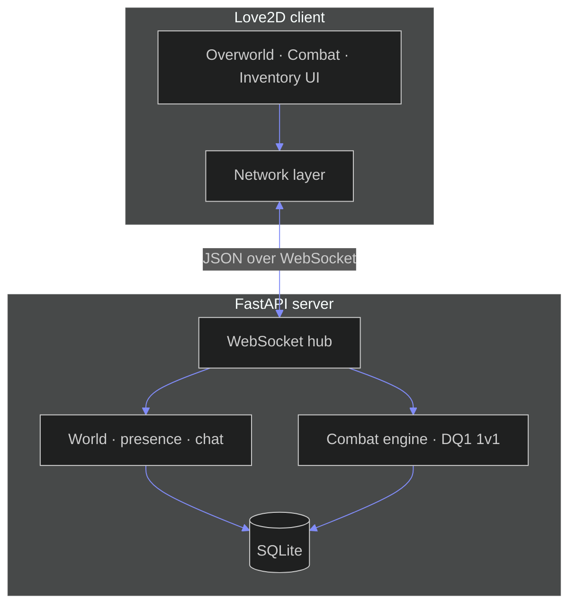

| Piece | Role for players |
|:------|:-----------------|
| **Client** | What you see and press — movement prediction, combat menus, chat |
| **Server** | Truth for fights, gold, position, who is online |
| **SQLite** | Heroes, inventory, accounts (local-first) |
| **Soft reconnect** | Brief disconnects keep mute list, **`/played` age**, **last whisper peer card**, **share · emote · invite** partners, and buffs when possible |
| **Peeks** | **`/status`**, **`/gold`**, **`/played`**, **`/version`**, **`/time`** — short plain lines so you know the room |

<p align="center">
  
  
  
</p>

<details>
<summary><b>ASCII postcard</b> · same idea without mermaid</summary>

```text
  ┌──────── Love2D ────────┐         ┌──────── FastAPI ────────┐
  │  Overworld · Combat    │  JSON   │  WebSocket hub          │
  │  Inventory · Chat UI   │◄───────►│  Combat · World · Shop  │
  └────────────────────────┘   WS    │         │               │
                                     │         ▼               │
                                     │      SQLite             │
                                     └─────────────────────────┘
         You press keys · server keeps the truth
```

</details>

---

## 🚀 Quick start

<p align="center">
  
  
  
  
</p>

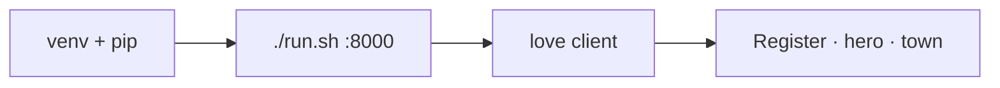

<table>
<tr>
<td width="50%" valign="top">

### 1 · Server

```bash
cd server
python3 -m venv .venv
source .venv/bin/activate   # Windows: .venv\Scripts\activate
pip install -r requirements.txt
./run.sh
```

| | |
|:--|:--|
| OpenAPI | http://127.0.0.1:8000/docs |
| Health | http://127.0.0.1:8000/health |
| WebSocket | `ws://127.0.0.1:8000/ws` |

</td>
<td width="50%" valign="top">

### 2 · Client

```bash
love client
```

1. **Register** → hero (**clothes** + gold + **3 herbs**)
2. **N** new · **D**/**Y** delete · max **3**
3. **Enter World** → **town** (safe)
4. **R** inn · **`/shop`** · **`/buy copper sword`** · **`/wave`** when friends join

</td>
</tr>
</table>

### 3 · Tests

```bash
cd server && source .venv/bin/activate
python tests/run_tests.py
# expect: 738 passed
```

---

## 🎮 Controls

<details open>
<summary><b>Overworld</b></summary>

<br/>

| Key | Action |
|:---:|:-------|
| **WASD** | Move |
| **T** / **Y** | Global / nearby chat |
| **/say** · **/s** | Nearby chat |
| **/g** · **/global** | Global chat |
| **/w Name msg** | Whisper (unique **prefix** OK) |
| **/z msg** · **/yell msg** · **/shout msg** | Zone chat |
| **/stuck** · **/unstuck** · **/home** | Free return to town (not in combat) |
| **/emote** · **/emotes** · **/wave** · **/wave Name** · **/wave @last** | List, perform, or direct an emote |
| **/lastemote** | Who you waved **at** and who waved **at you** (near/far) |
| **/w @emote** · **/wave @emote** | Reuse who *you* last waved at (**@** required) |
| **/w @emotedby** · **/wave @emotedby** | Reuse who last waved *at you* (**@** required) |
| **/invite Name** · **/meet @last** | Private meetup invite (not a party) |
| **/accept** · **/coming** · **/decline** · **/later** | Answer a meetup invite |
| **/cancel** · **/uninvite** | Take back your last invite |
| **/share Name** · **/share @last** | Privately share your zone + position |
| **/lastshare** | Who you shared with **and** who shared with you (near/far) |
| **/thank @share** · **/w @share** | Reuse who *you* last shared with (**@** required) |
| **/thank @from** · **/w @from** | Reuse who last shared *with you* (**@** required) |
| **/askwhere Name** · **/locate @last** | Ask where they are — they can **/share @last** |
| **/thank Name** · **/ty @last** | Private thanks (handy after a share) |
| **/poke Name** · **/nudge @last** | Private “trying to get your attention” · near/far confirm |
| **/lastinvite** | Who invited you **and** who you invited (near/far) |
| **/fighting** · **/combats** | Nearby heroes currently fighting |
| **/find combat:yes** · **/find fighting** | Online fighters (no map coords) |
| **/busy [reason]** | AFK alias (same as **/afk**) |
| **/buy copper sword** · **/sell herb** · **/shop** | Town shop — **names or ids** (optional qty) |
| **/use herb** · **/equip copper sword** | Use consumable · equip gear (slot auto) |
| **/cast heal** · **/repel** · **/return** | Field magic (when learned) |
| **/discard fairy water** | Destroy bag items (optional qty) |
| **/ping** | Latency check |
| **/r message** | Reply last whisper |
| **/last** · **/lastwhisper** | Who `/r` targets (near/far when online) |
| **/roll** · **/dice** · **/roll 20** | Nearby dice |
| **/counts** · **/census** | Online + zone totals |
| **/find Name** · **/find zone:town** · **/find afk** | Search online (no map coords) · plain summary + room census |
| **/who** · **/players** | Online + nearby + zones (**O**) |
| **/near** · **/here** | Heroes in view |
| **/zone** · **/where** · **/whereami** · **/mapinfo** | Your area + who is here |
| **/whereis Name** · **/profile Name** | Examine a hero (or yourself) |
| **/status** · **/me** · **/whoami** · **/stats** · **F** | Status sheet (nearby census · plain summary) |
| **/hp** · **/vitals** | HP / MP peek |
| **/xp** · **/level** | Level + XP to next |
| **/buffs** · **/effects** | Repel · radiant · AFK |
| **/keys** · **/controls** | Keybind summary |
| **/gold** · **/money** | Wallet peek |
| **/spells** · **/magic** | Known battle + field spells |
| **/bag** · **/inv** · **/items** · **I** | Inventory / bag |
| **/inspect Name** · **/look Name** | Examine a hero |
| **/unequip slot** · **/takeoff slot** | Unequip weapon / armor / shield / helmet |
| **/version** · **/about** · **/server** · **/info** | Server version + uptime |
| **/time** · **/uptime** | Server clock + uptime |
| **/played** · **/session** | How long this session has been open (+ zone / online) |
| **/profile** · **/card** · **/whereis** | Look / examine a hero (or yourself) |
| **/mapinfo** | Same as **/zone** — area + who is here |
| **/motd** · **/afk [reason]** · **/busy [reason]** · **/back** · **/quit** | Welcome · AFK (zone · nearby on confirm) · leave world |
| **/block** · **/blocklist** · **/ignores** · **/unblock** | Mute list (near/far when online) |
| **/ignore** · **/unignore** · **/ignores** | Mute list |
| **/inn** · **/rest** | Inn cost quote |
| **E** | Cycle emotes |
| **R** | Inn quote → **R** again to stay *(town)* |
| **H** / **M** | Field heal / cycle field spells |
| **K** | List spells |
| **L** · **/look** · **/look Name** | Look (near coords · far zone only · alone → yourself) |
| **I** | Inventory / shop |
| **Esc** | Disconnect & quit |

</details>

<details>
<summary><b>Combat</b></summary>

<br/>

| Key | Action |
|:---:|:-------|
| **↑ ↓** · **Enter** | Menu (spells show **MP cost**) |
| **1–9** | Jump to menu row |
| **A** / **F** / **H** | Attack · Flee · Herb |

</details>

<details>
<summary><b>Inventory</b></summary>

<br/>

| Key | Action |
|:---:|:-------|
| **Enter** | Use / equip / buy |
| **S** | Sell *(town)* |
| **D** | Discard one unit |
| **U** | Unequip |
| **R** | Inn *(town)* |
| **Tab** | Shop *(town)* |

Bag: **12** kinds · **8** each · title shows **used/max**.

</details>

<details>
<summary><b>Hero select</b></summary>

<br/>

| Key | Action |
|:---:|:-------|
| **↑ ↓** · **Enter** | Select / enter world |
| **N** | New hero |
| **D** then **Y** | Delete hero |
| **Esc** | Log out |

</details>

### Chat slash commands

| Command | Effect |
|:--------|:-------|
| `/w Name message` | Whisper — full name or **unique prefix** |
| `/r message` | Reply last whisper |
| `/last` · `/lastwhisper` | See who `/r` targets (near/far when online) |
| `/say` · `/s` · `/g` · `/z` · `/yell` · `/shout` | Nearby · global · zone chat |
| `/stuck` · `/unstuck` · `/home` | Free return to town |
| `/emote` · `/emotes` · `/wave` · `/wave Name` · `/wave @last` | List, perform, or direct an emote |
| `/lastemote` | Who you waved at **and** who waved at you (near/far) |
| `/w @emote` · `/wave @emote` · `/thank @emote` | Reuse who *you* last waved at (**@** required) |
| `/w @emotedby` · `/wave @emotedby` | Reuse who last waved *at you* (**@** required) |
| `/invite Name` · `/meet` · `/meet @last` | Meetup invite (private; not a party) |
| `/accept` · `/coming` · `/decline` · `/later` | Answer a meetup invite |
| `/cancel` · `/uninvite` | Cancel your last outgoing invite |
| `/share Name` · `/share @last` | Privately share zone + map position |
| `/lastshare` | Who you shared with **and** who shared with you (near/far) |
| `/thank @share` · `/w @share` · `/invite @share` · `/find @share` | Reuse last share peer (**@** required) |
| `/thank @from` · `/w @from` | Reuse who last shared *with you* (**@** required) |
| `/askwhere Name` · `/locate @last` | Ask where they are (they `/share @last`) |
| `/thank Name` · `/ty @last` · `/ty @from` | Private thanks · near/far confirm |
| `/poke Name` · `/nudge @last` | Private attention ping · near/far confirm |
| `/lastinvite` | Who invited you **and** who you invited (near/far) |
| `/fighting` · `/combats` | Nearby heroes in combat |
| `/find combat:yes` · `/find fighting` | Online fighters (no map coords) |
| `/busy [reason]` | Same as `/afk` — show as away |
| `/shop` · `/buy copper sword` · `/sell herb 2` | Town shop — **friendly names** (optional qty) |
| `/use herbs` · `/equip copper sword` | Use / equip (names OK; slot auto) |
| `/cast heal` · `/repel` · `/return` | Field magic when learned |
| `/discard fairy water` | Destroy bag items |
| `/ping` | Latency check |
| `/roll` · `/dice` · `/roll 20` | Nearby dice (default d100) |
| `/counts` · `/census` | Online + zone population |
| `/find Name` · `/find zone:field` · `/find afk` · `/find combat:yes` | Search (zone / AFK / combat filters, no coords) · plain summary |
| `/who` · `/players` · `/near` · `/zone` | Rosters & area info |
| `/hp` · `/vitals` · `/xp` · `/level` | HP/MP · level + XP |
| `/buffs` · `/effects` | Repel · radiant · AFK flags |
| `/keys` · `/controls` | Keybind cheat sheet |
| `/gold` · `/spells` · `/bag` · `/inv` | Wallet · magic list · inventory |
| `/inspect Name` · `/look Name` · `/profile Name` · `/whereis Name` | Examine a hero |
| `/unequip weapon` · `/takeoff armor` | Unequip a gear slot |
| `/version` · `/server` · `/info` · `/time` · `/whoami` | Server info · self sheet |
| `/played` · `/session` | This connection’s age |
| `/mapinfo` · `/zone` · `/where` | Your area + who is here |
| `/motd` · `/afk [reason]` · `/busy [reason]` · `/back` · `/quit` | Welcome · AFK badge (zone · nearby) · leave world |
| `/block` · `/blocklist` · `/ignore` · `/unignore` · `/ignores` | Mute list (near/far when online) |
| `/inn` · `/rest` | Inn cost quote |
| `/help` · **?** | Command list |

<p align="center">
  📖 <b>Player guide</b> → <a href="docs/HUMAN.md"><code>docs/HUMAN.md</code></a>
  &nbsp;·&nbsp;
  🤖 <b>Agents only</b> → <a href="AGENTS.md"><code>AGENTS.md</code></a>
</p>

---

## 🎨 Look & art

Drop PNGs into [`client/assets/`](client/assets/) — **filenames are the contract**.  
Missing files fall back to procedural drawing.

<p align="center">
  
  
  
  
  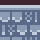
  &nbsp;&nbsp;
  
  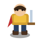
  
</p>

| Path | Files |
|:-----|:------|
| `tiles/` | `field` · `wall` · `town` · `water` · `dungeon` |
| `sprites/heroes/` | `hero.png` · `hero_battle.png` · `other.png` |
| `sprites/enemies/` | `{enemy_id}.png` (**40** enemies) |
| `svg/enemies/` | Editable SVG companions (optional) |
| `src/kenney/` · `src/tiny-creatures/` | CC0 masters |

```bash
./tools/gen_placeholder_assets.sh
python3 tools/import_open_assets.py --download
```

Licenses → **[client/assets/ATTRIBUTION.md](client/assets/ATTRIBUTION.md)**

---

## 👥 Multiplayer tools

| Tool | Purpose |
|:-----|:--------|
| `./tools/mp_sim.sh` | Headless multiplayer bots |
| `./tools/mp_sim.sh -n 5 --scenario wander --seconds 30` | Custom load |
| `./tools/mp_love.sh 2` | Two Love2D windows on one machine |

---

## ⚙️ Configuration

Optional: copy [`.env.example`](.env.example) → `.env`

| Variable | Purpose |
|:---------|:--------|
| `ENV` | `development` / `production` |
| `SECRET_KEY` | JWT — **strong secret in prod** |
| `DATABASE_URL` | SQLite path |
| `ALLOW_DEBUG` | `1` enables debug encounters (**B**) |
| `STARTING_GOLD` | New hero gold |
| `COMBAT_GRACE_SECONDS` | Mid-battle reconnect window |
| `GOOGLE_CLIENT_*` | Optional Google OAuth |
| `CORS_ORIGINS` | Browser CORS allow-list |

**Production:** strong `SECRET_KEY` · `ENV=production` · `ALLOW_DEBUG=0` · durable DB · tight CORS.

**Account:** change password with a logged-in token — `POST /auth/password`  
`{ "current_password": "…", "new_password": "…" }` (email/password accounts only).  
See OpenAPI at `/docs` or [docs/HUMAN.md](docs/HUMAN.md#hosting-operators).

---

## 📁 Project layout

```text
dq1_mmo/
├── README.md                 ← you are here (humans / GitHub)
├── AGENTS.md                 ← coding agents & LLMs only
├── plan.md                   ← historical roadmap (not live truth)
├── docs/
│   ├── README.md             ← docs map & audience rules
│   └── HUMAN.md              ← players & operators
├── client/                   ← Love2D + assets
├── server/                   ← FastAPI · combat · WebSocket
├── shared/                   ← dq1_data.json
└── tools/                    ← multiplayer sims · asset import
```

---

## 📚 Documentation

<p align="center">
  
  &nbsp;
  
  &nbsp;
  
  &nbsp;
  
</p>

<p align="center">
  <b>Human</b> docs and <b>agent / LLM</b> docs stay separate on purpose.<br/>
  <sub>Players never need the protocol file. Agents should not treat the README as the contract.</sub>
</p>

> [!IMPORTANT]
> **Two audiences, two trees — do not mix.**  
> **Play / host / art** → this README + [docs/HUMAN.md](docs/HUMAN.md) + [ATTRIBUTION](client/assets/ATTRIBUTION.md).  
> **Code agents** → **[AGENTS.md](AGENTS.md) only** (protocol · tests · reliability).  
> **Never** paste WebSocket catalogs or test matrices into player-facing pages.

<table>
<tr>
<td width="55%" valign="top">

#### 👤 For people

| Document | Contents |
|:---------|:---------|
| **[README.md](README.md)** *(this page)* | Install · features · controls · GitHub face |
| **[docs/HUMAN.md](docs/HUMAN.md)** | Gameplay · inn · magic · social · hosting |
| **[client/assets/ATTRIBUTION.md](client/assets/ATTRIBUTION.md)** | PNG names · CC0 licenses |
| **[docs/README.md](docs/README.md)** | Docs map & audience rules |
| [plan.md](plan.md) | Historical only — **not** live truth |

</td>
<td width="45%" valign="top">

#### 🤖 For coding agents / LLMs

| Document | Contents |
|:---------|:---------|
| **[AGENTS.md](AGENTS.md)** | **Only** agent entry |
| | Protocol · hot paths · tests · reliability |


</td>
</tr>
</table>

| Role | Start here |
|:-----|:-----------|
| **Player** | This README → [docs/HUMAN.md](docs/HUMAN.md) |
| **Host / ops** | [Quick start](#-quick-start) · [Configuration](#️-configuration) · HUMAN |
| **Artist** | [client/assets/ATTRIBUTION.md](client/assets/ATTRIBUTION.md) |
| **Coding agent** | **[`AGENTS.md`](AGENTS.md) only** — not this README |

| Do | Don’t |
|:---|:------|
| Keep install & controls in human docs | Paste protocol catalogs into README / HUMAN |
| Put protocol, reliability, tests in `AGENTS.md` | Treat `plan.md` as the live backlog |
| Keep slash-commands accurate for players | Document unfinished features as shipped |
| Bump version badges when `VERSION` changes | Leave HUMAN / README out of date |
| Link the other tree when useful | Copy agent contract text into player pages |

---

## 🙏 Credits

| | |
|:--|:--|
| **Inspiration** | *Dragon Quest I / Dragon Warrior* (NES-era combat math — not a ROM dump) |
| **Combat reference** | [dq1-combat](https://github.com/Im-Nova-Dev/dq1-combat) |
| **Art (CC0)** | [Kenney.nl](https://kenney.nl) · [Tiny Creatures](https://opengameart.org/content/tiny-creatures) — [ATTRIBUTION](client/assets/ATTRIBUTION.md) |
| **Badges / icons** | [shields.io](https://shields.io) · [skillicons.dev](https://skillicons.dev) · [github-readme-stats](https://github.com/anuraghazra/github-readme-stats) · mermaid · GFM |
| **Disclaimer** | Fan project — **not** Square Enix |

---

<p align="center">
  <a href="https://github.com/Im-Nova-Dev/dq1_mmo">
    
  </a>
  &nbsp;
  <a href="https://github.com/Im-Nova-Dev/dq1_mmo/stargazers">
    
  </a>
</p>

<p align="center">
  <a href="https://skillicons.dev">
    
  </a>
</p>

<p align="center">
  
</p>

<p align="center">
  <a href="https://star-history.com/#Im-Nova-Dev/dq1_mmo&Date">
    
  </a>
</p>

<p align="center">
  
  
  
  
</p>

<p align="center">
  <a href="docs/HUMAN.md"></a>
  &nbsp;
  <a href="AGENTS.md"></a>
  &nbsp;
  <a href="docs/README.md"></a>
  &nbsp;
  <a href="client/assets/ATTRIBUTION.md"></a>
  &nbsp;
  <a href="#-quick-start"></a>
</p>

<p align="center">
  <sub>Made for <b>people</b> first · coding agents use <b>AGENTS.md only</b> · fan project, not Square Enix</sub>
</p>
