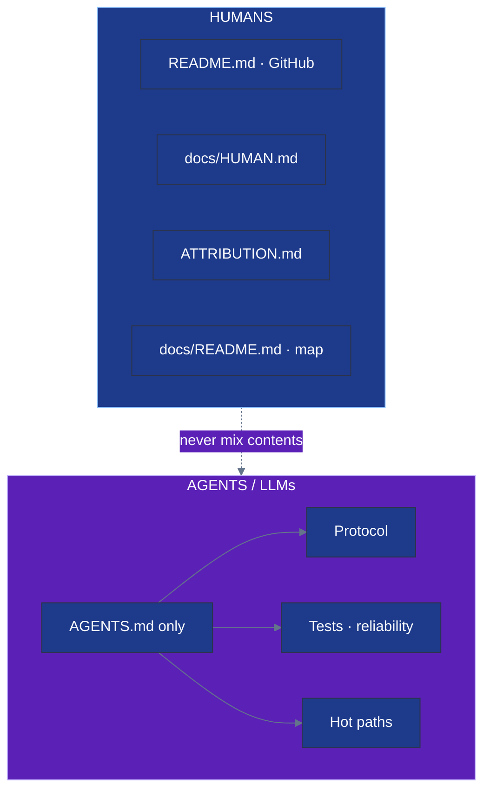

# Documentation index

**Human** documentation and **agent / LLM** documentation are intentionally separate.
Do not copy protocol tables, test matrices, or reliability rule lists into player-facing pages.

**Last docs refresh:** **v0.5.149** (2026-07-20) · suite **798** tests · use_item extract · humans ≠ agents

| Audience | May read | Must not treat as contract |
|:---------|:---------|:---------------------------|
| **Humans** | README · HUMAN · ATTRIBUTION · this map | `AGENTS.md` protocol tables |
| **Agents / LLMs** | **`AGENTS.md` first** | README / HUMAN as the API |

Keep these trees separate: player docs stay plain language; agent docs own protocol, reliability rules, and the test matrix.

| Rule | |
|:-----|:--|
| **Humans** | never need protocol / test-matrix files |
| **Agents** | never treat README or HUMAN as the contract |
| **README** | GitHub face — badges, install, controls — **no** WS catalogs |
| **AGENTS.md** | Single source of truth for coding agents |
| **Cross-link** | OK to *link* the other tree · never *copy* protocol into human pages |

---

## Start here by audience

| You are… | Open this | Then |
|:---------|:----------|:-----|
| **Player / operator** | [../README.md](../README.md) | [HUMAN.md](HUMAN.md) for gameplay & hosting |
| **Artist** | [../client/assets/ATTRIBUTION.md](../client/assets/ATTRIBUTION.md) | Drop PNGs; names are the contract |
| **Coding agent / LLM** | [../AGENTS.md](../AGENTS.md) **only** | Protocol, hot paths, tests, reliability |
| **Curious about history** | [../plan.md](../plan.md) | Original roadmap — **not** live truth |

  
  
  

---

## Human docs (plain language)

| Document | Purpose |
|:---------|:--------|
| [../README.md](../README.md) | Install, features, controls, polish for GitHub |
| [HUMAN.md](HUMAN.md) | Gameplay, inn, magic, social, hosting, art swap |
| [../client/assets/ATTRIBUTION.md](../client/assets/ATTRIBUTION.md) | PNG paths, CC0 sources, how to replace art |

**Covered for players (current):**

- Install & quick start · overworld / combat / inventory keys
- Zones · `/zone` · `/counts` · bag limits · **D** discard · inn **R** quote then confirm
- Whisper / look / ignore: full name or **unique prefix** (ambiguous names rejected)
- Nearby system lines: fight start · victory · flee · defeat · zone enter · level-ups · idle leave
- Social: `/say` `/g` `/w` `/z` `/roll` `/find` `/who` `/near` `/ignore` `/r` `/inn` …
- Shop town-only · not in combat · gold toasts · high-tier gear
- Join welcome may mention nearby heroes
- Soft reconnect: mute list, **last whisper partner** (near/far when online), **share partners**, **emote partners**, **meetup invite peers**, buffs, and **`/played` age** survive a brief disconnect
- Brief reconnect **keeps** `/played` / `/session` age; welcome may list **session timer** among Restored bits; after grace expires (or a full leave) the timer starts fresh
- Failed private messages do not block your next chat line
- `/version` · `/time` · `/whoami` · `/stats` · `/whereami` · `/motd` · `/afk` · `/quit`
- `/gold` · `/spells` · `/bag` · `/inv` · `/items`
- `/hp` · `/vitals` · `/xp` · `/level` · `/last` · `/unequip` · `/takeoff`
- `/buffs` · `/effects` · `/keys` · `/controls` · `/inspect` · `/blocklist`
- `/played` · `/session` — this connection’s age (+ zone / online)
- `/profile` · `/whereis` · `/mapinfo` · `/server` · `/info` · `/s` · `/g`
- `/stuck` · `/unstuck` · `/home` — free town return (nearby system notice) · `/yell` · `/shout` · `/emote` list
- AFK duration visible on look / online lists · nearby AFK/back system lines
- Buy/sell/equip/use clear AFK for peers · `/counts` shows online + AFK totals
- `/buy` · `/sell` · `/shop` · `/use` · `/equip` slash shop · `/ping` latency
- `/cast heal` · `/repel` · `/return` field magic · `/discard` from chat
- **Friendly item names** — `/buy copper sword` · `/equip dragon scale` · aliases like `herbs` / `wings`
- **`/afk lunch`** optional reason · peers see it on look / whisper · how many AFK on rosters
- **`/wave Name`** · **`/wave @last`** · **`/lastemote`** (to + from) · emote shortcuts (`/bow`, …)
- **`@emote`** = who *you* last waved at · **`@emotedby`** = who last waved *at you* (**@** required)
- **`@share`** = who *you* shared with · **`@from`** = who shared *with you* (**@** required)
- **Meetup loop (not a party):** **`/invite` · `/accept` · `/decline` · `/share` · `/askwhere` · `/thank` · `/cancel` · `/lastinvite` · `/pending`**
- **`/accept` · `/coming` · `/decline` · `/later`** — answer invites; near inviters get your map spot · far see zone only · failed reply keeps pending + restores AFK
- **`/askwhere` · `/locate`** — ask a hero where they are; they answer with **`/share @last`**
- **`/thank` · `/ty @last`** — private thanks (handy after a share)
- Stuck meetup invites **clear** if you answer while the inviter is offline · cancel while offline clears soft-reconnect ghosts
- **`/inn` · `/rest` · R quote/rest** — town only · not mid-fight · quote then pay · rest clears AFK for friends
- **`/bag` · `/equip` · `/unequip` · `/discard`** — not mid-fight · safe discard qty · equip/unequip/discard clears AFK for friends
- **`/shop` · `/buy` · `/sell`** — town only · not mid-fight · friendly item names · safe quantities · buy/sell clears AFK for friends
- **`/s` · `/g` · `/yell` · `/z`** — nearby · global · same-zone chat · mute respected · you always see your own line
- **`/wave` · `/emotes` · `/bow` · `/cheer`** — nearby friends see it · far directed waves still arrive · soft reconnect keeps **`/lastemote`**
- **`/poke` · `/nudge`** — private attention ping · **`/fighting`** nearby combat list
- **`/find combat:yes`** · **`/who`** fighting census · near/zone ⚔💤 name tags
- Failed private messages (whisper / invite / share / poke / askwhere / thank) do not block the next chat line; **AFK stays on** if you were away
- **`/busy`** AFK alias · safer multiplayer IDs · invite one-answer hygiene
- `/find afk` · `/find zone:town afk:yes` · join refreshes online list immediately
- Bare **L** looks at yourself; AFK on status sheet and online lists; clears on chat, emote, walk, or `/stuck`
- Whisper toasts distinguish “to” vs “from”; AFK targets get a quiet heads-up (plus reason if set)
- Zone chat only in town/field/dungeon; shout = zone (not world-wide)
- Online lists update promptly when people leave
- Safer buy/sell/discard quantities (0 and fractions rejected); bare buy/sell/discard need an item
- Safer multiplayer IDs (no weird boolean/float targets) · AFK reasons stay clean text
- Equip / unequip show clear toasts
- **Change password** for email accounts (`POST /auth/password`)
- Health check includes online, zones, combats, **AFK count**
- New heroes start with **clothes** equipped + **3 herbs**
- No emotes mid-combat (you can still list them)
- Emotes blocked during combat (emote list still works)
- Shop / equip / cast / stuck stay reliable when many peeks fire at once
- CC0 pixel art (Kenney + Tiny Creatures) + SVG companions

---

## Agent docs (technical contract)

| Document | Purpose |
|:---------|:--------|
| [../AGENTS.md](../AGENTS.md) | **Single** agent source of truth |

**Belongs only in AGENTS.md** (do not paste into README / HUMAN):

- Full WebSocket message catalogs
- Reliability rules · bag caps · reconnect / presence edge cases
- Test module matrix (`server/tests/run_tests.py`)
- Hot paths, architecture, coding constraints

---

## Audience rules

| Do | Don’t |
|:---|:------|
| Put install & controls in README / HUMAN | Dump WS protocol tables into README or HUMAN |
| Put protocol, tests, constraints in `AGENTS.md` | Put player install only in AGENTS |
| Bump `VERSION` with user-visible changes | Leave badges / HUMAN version out of date |
| Use plain language in README “What’s new” | Leak message types or test matrices to players |

---

## When the game changes

- [ ] `server/config.py` → `VERSION`
- [ ] [README.md](../README.md) badges · features · controls · test count
- [ ] [HUMAN.md](HUMAN.md) if player-facing
- [ ] [AGENTS.md](../AGENTS.md) if protocol / tests / reliability changed
- [ ] This index “last refresh” line
- [ ] Human prose stays free of protocol dumps
